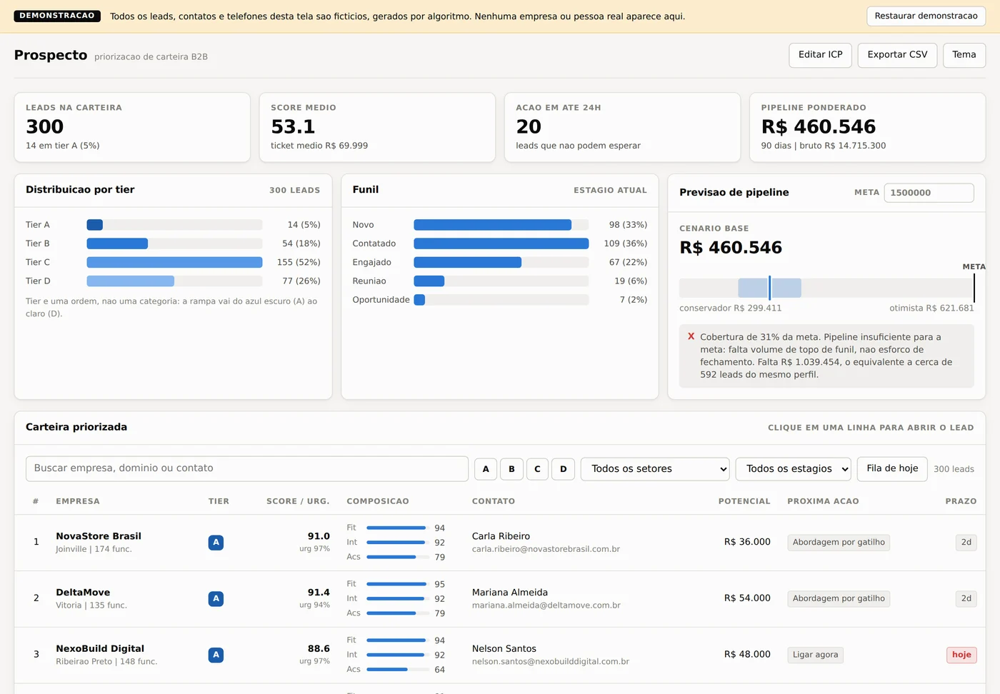
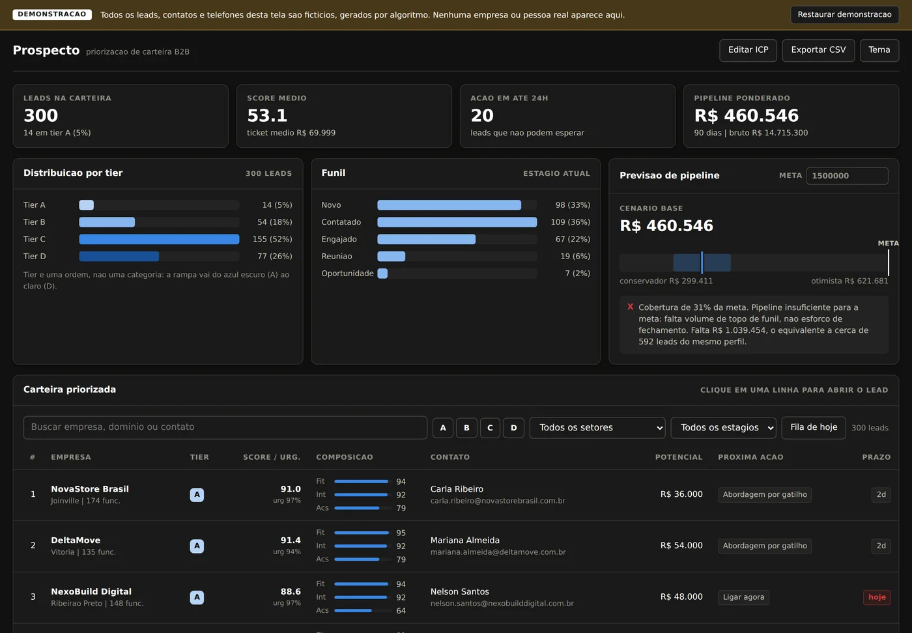
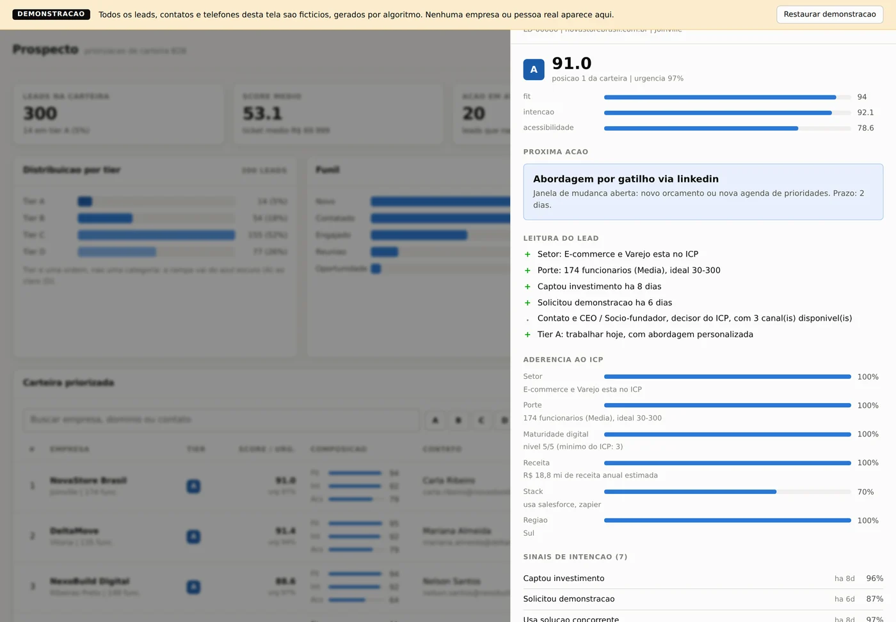

# Prospecto

**Um painel que responde a pergunta que todo vendedor faz de manhã: *para quem eu ligo primeiro hoje?***

### 👉 [Ver a demonstração ao vivo](https://teste1-k71r.onrender.com)

> A demo hiberna quando fica parada. Se a primeira carga demorar uns 40 segundos, é isso — depois fica rápida.
> Todos os dados são fictícios, gerados por algoritmo. Nenhuma empresa ou pessoa real aparece ali.



<details>
<summary>Também tem tema escuro</summary>



</details>

---

## O problema

Toda equipe comercial tem uma lista de leads. Quase nenhuma tem uma *ordem*.

Aí o dia começa e o vendedor abre a planilha com 800 nomes. Começa de cima, ou por quem
respondeu por último, ou por quem ele lembrou no banho. E o lead que visitou a página de
preços ontem fica esperando na linha 340.

Ferramentas de lead scoring costumam responder isso com um número. "Lead 84."

O problema é que 84 não diz nada. O vendedor não sabe se liga ou escreve. Não sabe o que
falar. E não faz ideia de por que esse lead veio antes do outro.

## O que o Prospecto faz diferente

Ele responde a pergunta inteira:

> **VetorTech Brasil — score 91, tier A.**
> Está no setor-alvo, tem 120 funcionários (dentro da faixa ideal), usa RD Station, abriu
> vaga de SDR há 6 dias, e o contato é o Head de Vendas com três canais disponíveis.
> **Ação: ligar hoje.** Cadência sugerida: trilha de contratação, 6 toques em 13 dias.

Cada número vem com o motivo colado nele. É a diferença entre um relatório e uma
ferramenta de trabalho.



---

## Como o score funciona

Três coisas independentes, porque misturá-las esconde informação importante:

| | O que mede | Por que separado |
|---|---|---|
| **Fit** | O quanto a empresa parece com seu cliente ideal | Muda devagar. É estrutural. |
| **Intenção** | O quanto ela está se mexendo *agora* | Perde valor todo dia. |
| **Acessibilidade** | Se dá para falar com quem decide | É operacional, não estratégico. |

Um lead pode ter perfil ótimo e nenhuma intenção — trabalhe depois. Ou muita intenção e
perfil ruim — não perca tempo. Um número só esconderia essa diferença.

### As decisões que mudam o resultado

**Sinal velho vale menos.** Cada tipo de sinal tem meia-vida própria: uma visita à página
de preços perde metade do peso em 10 dias, uma rodada de investimento em 120. Sem isso,
quem visitou em janeiro competiria de igual para igual com quem visitou ontem.

**Tamanho se mede por proporção, não por diferença.** Uma empresa de 10 pessoas num perfil
de 30 a 300 não está "20 unidades abaixo" — ela é três vezes menor. A conta antiga dava
88% de aderência para ela, o que é simplesmente falso. Agora dá 33%, que é o que qualquer
vendedor diria olhando.

**Dez aberturas de e-mail não valem uma resposta.** Todo sinal satura: o segundo confirma,
o quinto quase não acrescenta. Sem isso, quem gera muito ruído domina o ranking.

**Quem não serve, não sobe.** Se o lead bate num critério de desqualificação, o score
trava — por mais intenção que ele demonstre.

**A fila não é o ranking.** A ordem do dia usa o score ajustado pela urgência. Dois leads
80, um esfriando e outro que viu o preço ontem, não ocupam a mesma posição.

**E a fila mistura tiers de propósito.** Se o time só trabalhar tier A, o funil de médio
prazo seca e três meses depois o mês fecha vazio. Por isso há cota reservada.

---

## O que mais tem dentro

**Cadência de contato que sai pronta.** A trilha é escolhida pelo gatilho real do lead —
quem abriu vaga de SDR recebe um ângulo diferente de quem olhou o preço. São 7 trilhas, e
o esforço varia por tier: tier A ganha 6 toques multicanal, tier D ganha um e-mail de
nutrição. O texto sai para você revisar, não para enviar no automático.


**Previsão de pipeline em três cenários.** A probabilidade é composta pelas etapas que
ainda faltam, não chutada sobre o total. E a faixa cresce quando há muito negócio
duvidoso — não quando o pipeline é grande, que é o erro do "±20% fixo".

O diagnóstico responde o que o gestor realmente pergunta: não "quanto vou fechar", mas
**"o que está faltando, e de que tipo é o problema"**.

**Importação de CSV que aguenta planilha de verdade.** Ponto e vírgula, acento, BOM do
Excel, aspas escapadas, quebra de linha dentro da célula. E deduplica na entrada — porque
lista comprada + export do CRM + planilha do time é sempre a mesma empresa três vezes.
Quando junta duplicatas, mantém os sinais de todas: jogar fora sinal de intenção seria
perder o dado mais valioso do lead.

**Linha de comando completa.** Dá para trabalhar sem abrir o navegador:

```
prospecto fila --capacidade 25      # a lista de hoje
prospecto lead LD-00042             # abrir um lead
prospecto cadencia LD-00042         # gerar a sequência
prospecto previsao --meta 1500000   # projetar o pipeline
```

Todo comando aceita `--json`, então dá para encadear com o que você já usa:

```bash
prospecto ranking --tier A --json | jq -r '.[] | [.empresa, .contato.email] | @tsv'
```

---

## Rodando na sua máquina

Não tem instalação. Sério:

```bash
git clone https://github.com/LuisGuilherme605/Teste.git prospecto
cd prospecto
npm run demo
```

Sem `npm install`, sem chave de API, sem banco para configurar. **O projeto tem zero
dependências externas** — só Node 22 e o que já vem nele. O `package.json` tem a lista de
dependências vazia, e o CI falha se alguém acrescentar alguma.

Para abrir o painel: `npm start` e acesse `http://localhost:3000`.

---

## Colocando no ar

| Se você quer... | Leia |
|---|---|
| Uma demo pública de graça, sem cartão | [docs/demo-gratis.md](docs/demo-gratis.md) |
| Um servidor gratuito sempre ligado | [docs/oracle-cloud.md](docs/oracle-cloud.md) |
| Usar com leads de verdade | [docs/deploy.md](docs/deploy.md) |

Já vem pronto: `Dockerfile`, `docker-compose.yml` com HTTPS automático, configuração para
Fly.io e Render, script que instala num servidor Ubuntu limpo, e backup com rotação.

**Uma coisa importante sobre segurança:** o painel mostra nome, cargo, e-mail e telefone de
centenas de contatos. Por isso ele **se recusa a subir** num endereço público sem senha
configurada — e explica como resolver em vez de só quebrar. É proposital: publicar isso
aberto é vazamento de dados pessoais, com responsabilidade sua sob a LGPD.

A exceção é o modo demonstração, usado no link lá de cima: ele libera o acesso porque a
carteira é 100% gerada por algoritmo, e o painel avisa isso numa faixa que não sai da tela.

---

## Por dentro

```
bin/prospecto.js      a linha de comando
src/
  core/               a regra de negócio, sem nenhum I/O
  data/               vocabulário do domínio e gerador da carteira
  store/              SQLite; o único lugar com SQL
  server/             HTTP, API e autenticação
  lib/                CSV, deduplicação, sorteio determinístico
public/               o painel (sem build, sem framework)
docs/                 guias de publicação
test/                 215 testes
```

Duas regras sustentam o resto:

**`core` não importa `store` nem `server`.** É isso que permite usar o motor como
biblioteca, testar sem subir nada, e ter certeza de que a CLI e o painel nunca divergem —
os dois chamam exatamente o mesmo código.

**Nada é aleatório de verdade.** Não existe `Math.random` no domínio: o sorteio é próprio e
semeado. A mesma semente dá a mesma carteira em qualquer máquina, e o mesmo lead dá o mesmo
score sempre. Sem isso, nenhum teste de ranking seria confiável.

### Usando como biblioteca

O motor não precisa de servidor nem de banco:

```js
import { avaliarLead, normalizarIcp } from './src/index.js';

const icp = normalizarIcp({ setoresAlvo: ['industria'], funcionariosIdeal: { min: 50, max: 500 } });
const avaliacao = avaliarLead(meuLead, icp);

console.log(avaliacao.score, avaliacao.tier);
avaliacao.motivos.forEach((m) => console.log(m.texto));
```

---

## Testes

```bash
npm test         # 215 testes
npm run coverage # 98,8% das linhas
```

Os testes verificam propriedades que precisam valer sempre — se o score sobe quando
deveria subir, se o decaimento cai, se nada estoura os limites — e não números fixos, que
quebrariam a cada ajuste do modelo. A API sobe de verdade numa porta e é testada por HTTP,
incluindo os erros: 404, 422, JSON malformado, tentativa de acessar arquivo fora da pasta.

Uma varredura gera cadência para 250 leads diferentes e falha se qualquer combinação
deixar um `{{campo}}` vazar para o texto final.

O CI roda em Node 22 e 24, e além dos testes exercita os modos reais de publicação: com
senha, em demonstração, e a trava que recusa subir exposto.

---

## O que ainda não está resolvido

Prefiro dizer do que deixar você descobrir:

- **As taxas de conversão da previsão são estimativas**, não o seu histórico. Estão isoladas
  num objeto só para serem trocadas. Até lá, confie na *ordem* dos leads; o valor absoluto
  do pipeline é indicativo.
- **Uma instância só.** SQLite em arquivo não aceita dois processos escrevendo juntos. Não é
  a quantidade de leads que obriga a trocar por PostgreSQL — é a quantidade de processos.
  E quando precisar, só um arquivo muda.
- **A senha é compartilhada.** Não há usuários individuais. Acima de três ou quatro pessoas,
  você perde o rastro de quem fez o quê.
- **Sem criptografia em repouso.** Quem tiver acesso ao servidor lê o banco.

---

## Licença

MIT — veja [LICENSE](LICENSE). Use, modifique e publique à vontade.
