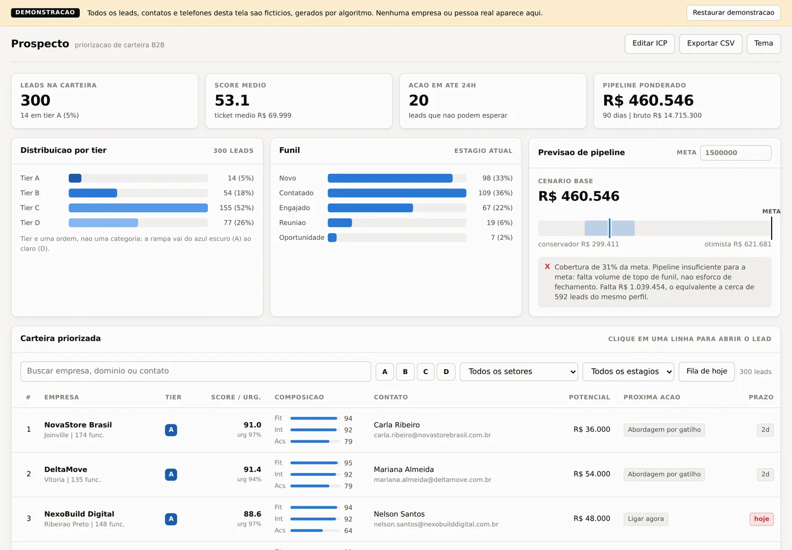
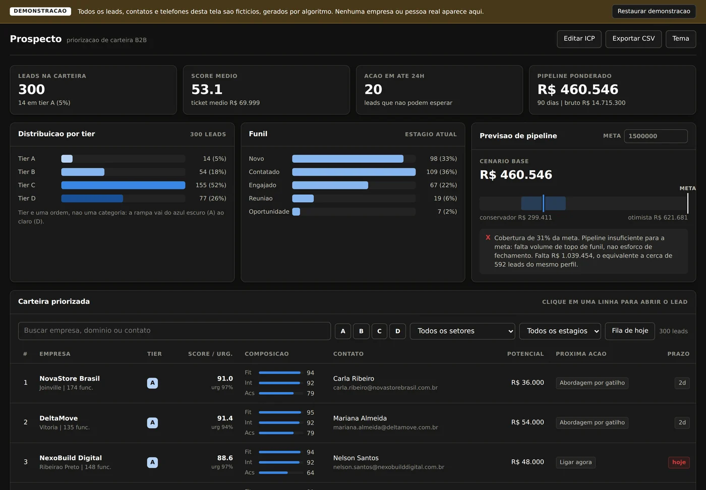
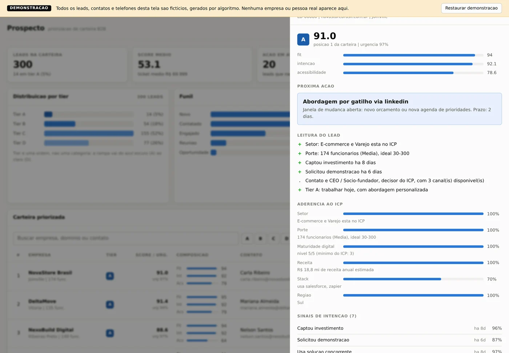

# Prospecto

[](https://github.com/LuisGuilherme605/prospecto-demo/actions/workflows/ci.yml) [](LICENSE) [](package.json) [](package.json)

Painel de prospecção B2B. Responde a pergunta que o vendedor faz todo dia de manhã: pra quem eu ligo primeiro?

[Ver a demo ao vivo](https://teste1-k71r.onrender.com)

> A demo hiberna quando fica parada. Se demorar uns 40s pra carregar na primeira vez, é isso.
> Todos os dados são fictícios. Nenhuma empresa ou pessoa real aparece ali.



<details>
<summary>Tema escuro</summary>



</details>

---

## O problema

Toda equipe comercial tem lista de leads. Quase nenhuma tem uma ordem.

O vendedor abre a planilha com 800 nomes e começa de cima, ou por quem respondeu por último, ou por quem lembrou. E o lead que visitou a página de preços ontem fica lá na linha 340.

Ferramentas de lead scoring jogam um número: "Lead 84". Mas 84 não diz nada. O vendedor não sabe se liga ou escreve, não sabe o que falar, e não faz ideia de por que esse lead veio antes do outro.

## O que o Prospecto faz

Ele dá a resposta completa:

> VetorTech Brasil, score 91, tier A.
> Setor-alvo, 120 funcionários, usa RD Station, abriu vaga de SDR há 6 dias, contato é Head de Vendas com 3 canais.
> Ação: ligar hoje. Cadência sugerida: trilha de contratação, 6 toques em 13 dias.

Cada número vem com o motivo junto.



---

## Como o score funciona

Três eixos separados:

| | Mede o quê | Por que separar |
|---|---|---|
| Fit | Quanto a empresa parece com o cliente ideal | Muda devagar, é estrutural |
| Intenção | Quanto ela tá se mexendo agora | Perde valor todo dia |
| Acessibilidade | Se dá pra falar com quem decide | É operacional |

Um lead pode ter perfil bom e zero intenção (trabalha depois). Ou muita intenção e perfil ruim (não perde tempo). Um número só esconde essa diferença.

### Decisões importantes

- Sinal velho vale menos. Cada tipo de sinal tem meia-vida: visita na página de preços perde metade do peso em 10 dias, rodada de investimento em 120.
- Tamanho se mede por proporção. Empresa de 10 pessoas num perfil de 30 a 300 não tá "20 abaixo", tá 3x menor.
- Dez aberturas de email não valem uma resposta. Todo sinal satura.
- Quem não serve, não sobe. Se bate num critério de desqualificação, o score trava.
- A fila não é o ranking. A ordem do dia usa score ajustado pela urgência.
- A fila mistura tiers de propósito. Se só trabalhar tier A, o funil de médio prazo seca.

---

## O que mais tem

**Cadência de contato pronta.** A trilha é escolhida pelo gatilho real do lead. São 7 trilhas, e o esforço varia por tier. O texto sai pra você revisar, não pra enviar no automático.


**Previsão de pipeline em 3 cenários.** A probabilidade é composta pelas etapas que faltam, não chutada sobre o total.

**Importação de CSV de verdade.** Ponto e vírgula, acento, BOM do Excel, aspas escapadas, quebra de linha dentro da célula. Deduplica na entrada.

**CLI completa:**

```
prospecto fila --capacidade 25      # lista de hoje
prospecto lead LD-00042             # ver um lead
prospecto cadencia LD-00042         # gerar a sequência
prospecto previsao --meta 1500000   # projetar pipeline
```

Todo comando aceita `--json`:

```bash
prospecto ranking --tier A --json | jq -r '.[] | [.empresa, .contato.email] | @tsv'
```

---

## Rodando

Não precisa instalar nada:

```bash
git clone https://github.com/LuisGuilherme605/prospecto-demo.git prospecto
cd prospecto
npm run demo
```

Sem `npm install`, sem chave de API, sem banco. Zero dependências externas, só Node 22. O CI falha se alguém adicionar alguma.

Pra abrir o painel: `npm start` e acessa `http://localhost:3000`.

---

## Deploy

| Quer... | Leia |
|---|---|
| Demo pública de graça | [docs/demo-gratis.md](docs/demo-gratis.md) |
| Servidor gratuito sempre ligado | [docs/oracle-cloud.md](docs/oracle-cloud.md) |
| Usar com leads de verdade | [docs/deploy.md](docs/deploy.md) |

Já vem com Dockerfile, docker-compose com HTTPS automático, config pra Fly.io e Render, script de instalação e backup.

Sobre segurança: o painel mostra nome, cargo, email e telefone de centenas de contatos. Por isso ele se recusa a subir num endereço público sem senha. A exceção é o modo demo, que só roda com dados fictícios e avisa isso na tela.

---

## Estrutura

```
bin/prospecto.js      CLI
src/
  core/               regra de negócio, sem I/O
  data/               vocabulário e gerador da carteira
  store/              SQLite, único lugar com SQL
  server/             HTTP, API e autenticação
  lib/                CSV, deduplicação, sorteio
public/               painel web (sem build, sem framework)
docs/                 guias de deploy
test/                 215 testes
```

Duas regras:

- `core` não importa `store` nem `server`. Dá pra usar o motor como lib e testar sem subir nada.
- Nada é aleatório de verdade. O sorteio é semeado: mesma semente, mesma carteira, mesmo score sempre.

### Usando como lib

```js
import { avaliarLead, normalizarIcp } from './src/index.js';

const icp = normalizarIcp({ setoresAlvo: ['industria'], funcionariosIdeal: { min: 50, max: 500 } });
const avaliacao = avaliarLead(meuLead, icp);

console.log(avaliacao.score, avaliacao.tier);
avaliacao.motivos.forEach((m) => console.log(m.texto));
```

---

## Testes

```bash
npm test         # 215 testes
npm run coverage # 98,8% das linhas
```

Os testes verificam propriedades (se o score sobe quando deveria, se o decaimento funciona, se nada estoura os limites), não números fixos. A API sobe de verdade e é testada por HTTP, incluindo erros. CI roda em Node 22 e 24.

---

## Limitações

- As taxas de conversão da previsão são estimativas, não seu histórico. Confie na ordem dos leads, o valor absoluto é indicativo.
- Uma instância só. SQLite não aceita dois processos escrevendo ao mesmo tempo.
- Senha compartilhada. Não tem usuários individuais.
- Sem criptografia em repouso.

---

## Contribuindo

Veja [CONTRIBUTING.md](CONTRIBUTING.md). Falha de segurança vai por [SECURITY.md](SECURITY.md).

## Licença

MIT. Veja [LICENSE](LICENSE).
